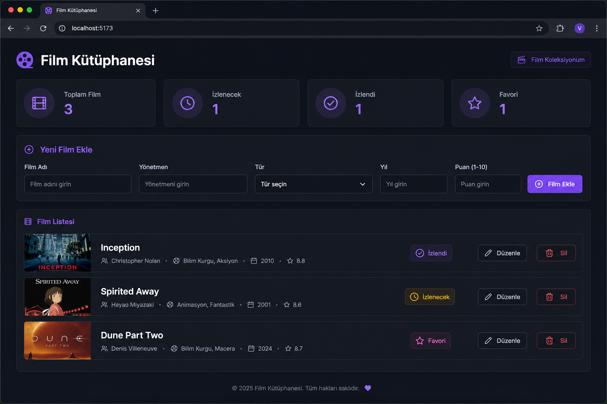

# Film Kütüphanesi

Web Geliştirme eğitimi kapsamında hazırlanan **Vue 3 + Vite + Tailwind CSS** tabanlı kişisel film takip uygulaması.

Örnek projelerden farklı olarak bu uygulama bir TODO listesi değil; izlenecek, izlenen ve favori filmlerinizi yönetmenizi sağlayan bir **Film Kütüphanesi**dir.

## Özellikler

- **Ekle:** Yeni film kaydı oluşturma
- **Listele:** Tüm filmleri kart görünümünde listeleme
- **Güncelle:** Mevcut film bilgilerini düzenleme
- **Sil:** Film kaydını silme
- **LocalStorage:** Veriler tarayıcıda kalıcı olarak saklanır
- **Filtreleme:** Durum, tür ve arama ile filtreleme

## Teknolojiler

| Alan | Seçim |
|------|-------|
| Framework | Vue 3 |
| Build Tool | Vite |
| CSS | Tailwind CSS 4 |
| Veri Saklama | LocalStorage |
| Yayın | Netlify |

## Proje Yapısı

```
film-kutuphanesi/
├── public/
├── screenshots/
├── src/
│   ├── Components/
│   │   ├── AppHeader.vue
│   │   ├── FilmCard.vue
│   │   ├── FilmForm.vue
│   │   ├── FilmList.vue
│   │   └── StatsBar.vue
│   ├── Pages/
│   │   └── HomePage.vue
│   ├── Interfaces/
│   │   └── Film.js
│   ├── composables/
│   │   └── useFilms.js
│   ├── App.vue
│   ├── main.js
│   └── style.css
├── index.html
├── netlify.toml
└── package.json
```

## Kurulum

```bash
git clone https://github.com/VolkanTasbent/film_kutuphanesi.git
cd film-kutuphanesi
npm install
npm run dev
```

Uygulama varsayılan olarak `http://localhost:5173` adresinde açılır.

## Build

```bash
npm run build
npm run preview
```

## Ekran Görüntüsü



## Yönerge Uyumu

Bu proje eğitim programı **Web Geliştirme / Javascript** yönergesindeki tüm maddeleri karşılar:

| Gereksinim | Karşılama |
|------------|-----------|
| VueJS (modern JS kütüphanesi) | Vue 3 + Vite |
| LocalStorage | `useFilms.js` composable |
| Netlify uyumlu çerçeve | Vite + `netlify.toml` |
| Components / Pages / Interfaces | `src/` altında ayrı klasörler |
| Tailwind CSS | Tailwind CSS 4 |
| CRUD (Ekle, Listele, Güncelle, Sil) | Tam destek |
| Ekran görüntüsü | `screenshots/ana-ekran.png` |
| GitHub public repo | Teslim adımları aşağıda |
| Netlify yayını | Teslim adımları aşağıda |

Detaylı teslim bilgileri için [`PROJE_TESLIM.md`](./PROJE_TESLIM.md) dosyasına bakın.

## GitHub'a Yükleme

```bash
cd ~/development/film-kutuphanesi
git commit -m "Film Kütüphanesi - Vue 3 CRUD eğitim projesi"
gh auth login
gh repo create film-kutuphanesi --public --source=. --remote=origin --push
```

## Netlify'a Yayınlama

1. [Netlify](https://www.netlify.com/) → **Add new site → Import an existing project**
2. GitHub reposunu bağlayın
3. Build: `npm run build` · Publish: `dist`
4. Deploy sonrası URL'yi teslim formuna ekleyin

Alternatif (Netlify CLI):

```bash
npm install -g netlify-cli
npm run build
netlify login
netlify deploy --prod --dir=dist
```

## Geliştirici

Eğitim projesi — Web Geliştirme / Javascript
